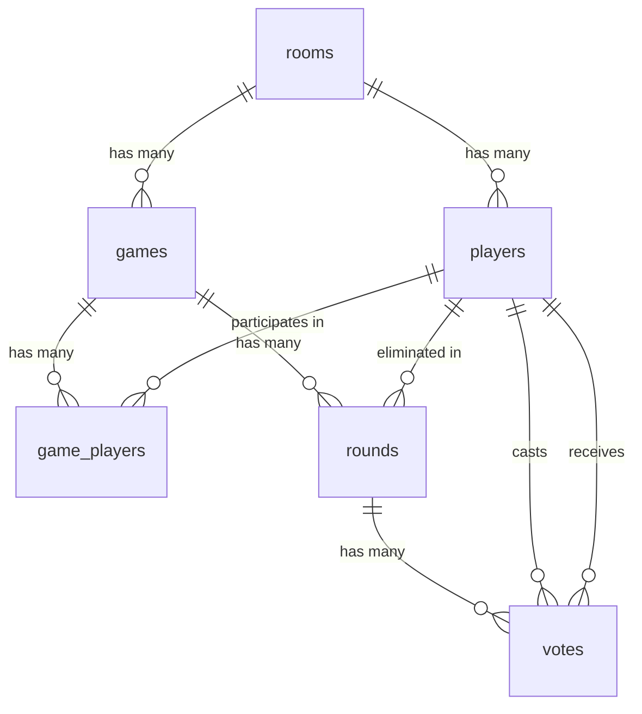

# Supabase Database Documentation

Esta documentação descreve a estrutura do banco de dados Supabase utilizado no Impostor Game.

## Visão Geral

O banco de dados é composto por **6 tabelas principais** que gerenciam salas, jogadores, jogos, rodadas e votos.



---

## Tabelas

### 1. `rooms` - Salas

Representa uma sala de jogo onde os jogadores se reúnem. Uma sala pode ter múltiplos jogos.

| Coluna       | Tipo                | Nullable | Default             | Descrição                             |
| :----------- | :------------------ | :------- | :------------------ | :------------------------------------ |
| `id`         | `uuid`              | ❌       | `gen_random_uuid()` | Identificador único da sala           |
| `code`       | `string`            | ❌       | -                   | Código de acesso da sala (ex: "ABCD") |
| `host_id`    | `string`            | ❌       | -                   | ID do jogador que é o host da sala    |
| `status`     | `string`            | ✅       | -                   | Status atual da sala                  |
| `created_at` | `timestamp with tz` | ✅       | `now()`             | Data/hora de criação                  |

#### Status da Sala (`rooms.status`)

| Status          | Descrição                                           | UI Component             |
| :-------------- | :-------------------------------------------------- | :----------------------- |
| `waiting`       | Aguardando jogadores entrarem                       | `<Lobby />`              |
| `playing`       | Sessão ativa, jogos podem ser criados e jogados     | Game Screens             |
| `game_finished` | Host encerrou a sessão, mostra estatísticas globais | `<SessionEndedScreen />` |

---

### 2. `players` - Jogadores

Representa um jogador conectado a uma sala.

| Coluna      | Tipo                | Nullable | Default             | Descrição                                          |
| :---------- | :------------------ | :------- | :------------------ | :------------------------------------------------- |
| `id`        | `uuid`              | ❌       | `gen_random_uuid()` | Identificador único do jogador                     |
| `name`      | `string`            | ❌       | -                   | Nome do jogador                                    |
| `client_id` | `string`            | ❌       | -                   | ID do cliente (navegador) para identificação       |
| `room_id`   | `uuid`              | ✅       | -                   | FK para a sala atual (null se não estiver em sala) |
| `score`     | `integer`           | ✅       | `0`                 | Pontuação acumulada do jogador                     |
| `joined_at` | `timestamp with tz` | ✅       | `now()`             | Data/hora de entrada na sala                       |

#### Relacionamentos

- `room_id` → `rooms.id` (Many-to-One)

---

### 3. `games` - Jogos

Representa uma partida individual dentro de uma sala.

| Coluna          | Tipo                | Nullable | Default             | Descrição                         |
| :-------------- | :------------------ | :------- | :------------------ | :-------------------------------- |
| `id`            | `uuid`              | ❌       | `gen_random_uuid()` | Identificador único do jogo       |
| `room_id`       | `uuid`              | ❌       | -                   | FK para a sala onde o jogo ocorre |
| `word`          | `string`            | ✅       | -                   | Palavra secreta do jogo           |
| `status`        | `string`            | ✅       | -                   | Status atual do jogo              |
| `current_round` | `integer`           | ✅       | `1`                 | Número da rodada atual            |
| `winner`        | `string`            | ✅       | -                   | Vencedor: 'impostor' ou 'players' |
| `created_at`    | `timestamp with tz` | ✅       | `now()`             | Data/hora de criação do jogo      |
| `ended_at`      | `timestamp with tz` | ✅       | -                   | Data/hora de término do jogo      |

#### Status do Jogo (`games.status`)

| Status            | Descrição                                                        | UI Component                 |
| :---------------- | :--------------------------------------------------------------- | :--------------------------- |
| `reveal`          | Início do jogo. Mostra Role (Impostor/Cidadão) e Palavra Secreta | `<GameScreen />`             |
| `voting`          | Fase de discussão/votação                                        | `<VotingScreen />`           |
| `vote_result`     | Mostra resultados da votação da rodada                           | `<VotingScreen />` (Results) |
| `vote_conclusion` | Feedback individual do voto (pontuação é calculada aqui)         | `<VoteConclusionScreen />`   |
| `game_over`       | Fim do jogo, vencedor determinado                                | `<ResultsScreen />`          |

#### Relacionamentos

- `room_id` → `rooms.id` (Many-to-One)

---

### 4. `game_players` - Jogadores no Jogo

Tabela de junção que associa jogadores a um jogo específico e define seus papéis.

| Coluna              | Tipo      | Nullable | Default             | Descrição                               |
| :------------------ | :-------- | :------- | :------------------ | :-------------------------------------- |
| `id`                | `uuid`    | ❌       | `gen_random_uuid()` | Identificador único                     |
| `game_id`           | `uuid`    | ❌       | -                   | FK para o jogo                          |
| `player_id`         | `uuid`    | ❌       | -                   | FK para o jogador                       |
| `is_impostor`       | `boolean` | ✅       | `false`             | Se este jogador é o impostor neste jogo |
| `is_eliminated`     | `boolean` | ✅       | `false`             | Se o jogador foi eliminado              |
| `role_acknowledged` | `boolean` | ✅       | `false`             | Se o jogador viu a tela de role         |

#### Relacionamentos

- `game_id` → `games.id` (Many-to-One)
- `player_id` → `players.id` (Many-to-One)

---

### 5. `rounds` - Rodadas

Representa uma rodada de votação dentro de um jogo.

| Coluna                 | Tipo                | Nullable | Default             | Descrição                                            |
| :--------------------- | :------------------ | :------- | :------------------ | :--------------------------------------------------- |
| `id`                   | `uuid`              | ❌       | `gen_random_uuid()` | Identificador único da rodada                        |
| `game_id`              | `uuid`              | ❌       | -                   | FK para o jogo                                       |
| `round_number`         | `integer`           | ❌       | -                   | Número sequencial da rodada                          |
| `eliminated_player_id` | `uuid`              | ✅       | -                   | FK para o jogador eliminado nesta rodada (se houver) |
| `majority_action`      | `string`            | ✅       | -                   | Ação da maioria (ex: "eliminate", "skip")            |
| `created_at`           | `timestamp with tz` | ✅       | `now()`             | Data/hora de criação da rodada                       |
| `ended_at`             | `timestamp with tz` | ✅       | -                   | Data/hora de conclusão da rodada                     |

#### Valores de `majority_action`

| Valor       | Descrição                                         |
| :---------- | :------------------------------------------------ |
| `eliminate` | Maioria votou para eliminar um jogador específico |
| `skip`      | Maioria votou para pular a rodada                 |
| `null`      | Rodada ainda não concluída                        |

#### Relacionamentos

- `game_id` → `games.id` (Many-to-One)
- `eliminated_player_id` → `players.id` (Many-to-One, nullable)

---

### 6. `votes` - Votos

Registra cada voto individual em uma rodada.

| Coluna             | Tipo                | Nullable | Default             | Descrição                                          |
| :----------------- | :------------------ | :------- | :------------------ | :------------------------------------------------- |
| `id`               | `uuid`              | ❌       | `gen_random_uuid()` | Identificador único do voto                        |
| `round_id`         | `uuid`              | ❌       | -                   | FK para a rodada                                   |
| `voter_id`         | `uuid`              | ❌       | -                   | FK para o jogador que votou                        |
| `target_player_id` | `uuid`              | ✅       | -                   | FK para o jogador que recebeu o voto (null = skip) |
| `is_action_vote`   | `boolean`           | ✅       | `false`             | Se é um voto de ação (próxima rodada/fim de jogo)  |
| `action_vote`      | `string`            | ✅       | -                   | Tipo de ação votada                                |
| `created_at`       | `timestamp with tz` | ✅       | `now()`             | Data/hora do voto                                  |

#### Tipos de `action_vote`

| Valor        | Descrição                                     |
| :----------- | :-------------------------------------------- |
| `next_round` | Votou para continuar para a próxima rodada    |
| `end_game`   | Votou para encerrar o jogo                    |
| `null`       | Voto normal de eliminação (não é action vote) |

#### Relacionamentos

- `round_id` → `rounds.id` (Many-to-One)
- `voter_id` → `players.id` (Many-to-One)
- `target_player_id` → `players.id` (Many-to-One, nullable)

---

## Diagrama de Relacionamentos

```
                              ┌─────────────┐
                              │    rooms    │
                              ├─────────────┤
                              │ id (PK)     │
                              │ code        │
                              │ host_id     │
                              │ status      │
                              │ created_at  │
                              └──────┬──────┘
                                     │
                    ┌────────────────┼────────────────┐
                    │ 1:N            │                │ 1:N
                    ▼                │                ▼
             ┌─────────────┐         │         ┌─────────────┐
             │   players   │         │         │    games    │
             ├─────────────┤         │         ├─────────────┤
             │ id (PK)     │         │         │ id (PK)     │
             │ name        │         │         │ room_id (FK)│
             │ client_id   │         │         │ word        │
             │ room_id (FK)│◄────────┘         │ status      │
             │ score       │                   │ current_round│
             │ joined_at   │                   │ created_at  │
             └──────┬──────┘                   └──────┬──────┘
                    │                                 │
                    │                    ┌────────────┼────────────┐
                    │                    │ 1:N        │ 1:N        │
                    │                    ▼            │            ▼
                    │           ┌─────────────┐       │   ┌──────────────┐
                    │           │game_players │       │   │    rounds    │
                    │           ├─────────────┤       │   ├──────────────┤
                    │           │ id (PK)     │       │   │ id (PK)      │
                    ├──────────►│ game_id (FK)│◄──────┘   │ game_id (FK) │
                    │     N:1   │ player_id(FK)│          │ round_number │
                    │           │ is_impostor │          │ eliminated_id│
                    │           └─────────────┘          │ majority_action│
                    │                                    │ created_at   │
                    │                                    └───────┬──────┘
                    │                                            │ 1:N
                    │                                            ▼
                    │                                   ┌─────────────┐
                    │                                   │    votes    │
                    │                                   ├─────────────┤
                    │                                   │ id (PK)     │
                    ├──────────────────────────────────►│ round_id(FK)│
                    │  N:1 (voter)                      │ voter_id(FK)│
                    └──────────────────────────────────►│ target_id(FK)│
                       N:1 (target)                     │ is_action   │
                                                        │ action_vote │
                                                        │ created_at  │
                                                        └─────────────┘
```

---

## Sistema de Pontuação

Os pontos são armazenados na coluna `players.score` e calculados na tela `<VoteConclusionScreen />`.

| Evento                                | Pontos | Descrição                                         |
| :------------------------------------ | -----: | :------------------------------------------------ |
| **Voto Correto**                      |    +10 | Votar no impostor                                 |
| **Impostor Sobrevive Rodada**         |     +5 | Impostor ganha pontos por cada rodada sobrevivida |
| **Jogadores Vencem (Pegam Impostor)** |    +20 | Bônus para todos os não-impostores                |
| **Impostor Vence (1v1 ou Skip)**      |    +20 | Bônus para o impostor                             |

---

## Fluxo de Dados

### 1. Criar Sala

```sql
INSERT INTO rooms (code, host_id, status)
VALUES ('ABCD', player_id, 'waiting');
```

### 2. Jogador Entra na Sala

```sql
INSERT INTO players (name, client_id, room_id)
VALUES ('João', 'browser-uuid', room_id);
```

### 3. Iniciar Jogo

```sql
-- Criar jogo
INSERT INTO games (room_id, word, status, current_round)
VALUES (room_id, 'banana', 'reveal', 1);

-- Definir jogadores do jogo
INSERT INTO game_players (game_id, player_id, is_impostor)
VALUES
  (game_id, player_1, false),
  (game_id, player_2, true),  -- Impostor
  (game_id, player_3, false);

-- Criar primeira rodada
INSERT INTO rounds (game_id, round_number)
VALUES (game_id, 1);

-- Atualizar status da sala
UPDATE rooms SET status = 'playing' WHERE id = room_id;
```

### 4. Votar

```sql
INSERT INTO votes (round_id, voter_id, target_player_id)
VALUES (round_id, voter_id, target_id);
```

### 5. Finalizar Rodada

```sql
-- Registrar eliminação (se houver)
UPDATE rounds
SET eliminated_player_id = player_id, majority_action = 'eliminate'
WHERE id = round_id;

-- Atualizar status do jogo
UPDATE games SET status = 'vote_result' WHERE id = game_id;
```

### 6. Atualizar Pontuação

```sql
UPDATE players SET score = score + 10 WHERE id = player_id;
```

---

## TypeScript Types

O arquivo `lib/supabase/database.types.ts` contém os tipos gerados automaticamente pelo Supabase CLI.

### Uso dos Types

```typescript
import { Database } from "@/lib/supabase/database.types";

// Tipos de linha (para leitura)
type Room = Database["public"]["Tables"]["rooms"]["Row"];
type Player = Database["public"]["Tables"]["players"]["Row"];
type Game = Database["public"]["Tables"]["games"]["Row"];
type GamePlayer = Database["public"]["Tables"]["game_players"]["Row"];
type Round = Database["public"]["Tables"]["rounds"]["Row"];
type Vote = Database["public"]["Tables"]["votes"]["Row"];

// Tipos de inserção (campos opcionais marcados)
type RoomInsert = Database["public"]["Tables"]["rooms"]["Insert"];
type PlayerInsert = Database["public"]["Tables"]["players"]["Insert"];

// Tipos de atualização (todos os campos são opcionais)
type RoomUpdate = Database["public"]["Tables"]["rooms"]["Update"];
type PlayerUpdate = Database["public"]["Tables"]["players"]["Update"];
```

### Helpers de Tipo

```typescript
import {
  Tables,
  TablesInsert,
  TablesUpdate,
} from "@/lib/supabase/database.types";

// Forma simplificada
type Room = Tables<"rooms">;
type RoomInsert = TablesInsert<"rooms">;
type RoomUpdate = TablesUpdate<"rooms">;
```

---

## Real-time Subscriptions

O Supabase Real-time é utilizado para sincronizar o estado entre todos os jogadores.

### Tabelas com Subscription

| Tabela    | Canal         | Eventos Monitorados    |
| :-------- | :------------ | :--------------------- |
| `rooms`   | `room:{code}` | UPDATE                 |
| `players` | `room:{code}` | INSERT, UPDATE, DELETE |
| `games`   | `room:{code}` | INSERT, UPDATE         |
| `rounds`  | `room:{code}` | INSERT, UPDATE         |

### Exemplo de Subscription

```typescript
const channel = supabase
  .channel(`room:${roomCode}`)
  .on(
    "postgres_changes",
    {
      event: "*",
      schema: "public",
      table: "rooms",
      filter: `code=eq.${roomCode}`,
    },
    (payload) => {
      /* handle room change */
    },
  )
  .on(
    "postgres_changes",
    {
      event: "*",
      schema: "public",
      table: "players",
      filter: `room_id=eq.${roomId}`,
    },
    (payload) => {
      /* handle player change */
    },
  )
  .subscribe();
```

---

## Índices Recomendados

Para otimizar as queries mais comuns:

```sql
-- Buscar sala por código
CREATE INDEX idx_rooms_code ON rooms(code);

-- Buscar jogadores de uma sala
CREATE INDEX idx_players_room_id ON players(room_id);

-- Buscar jogos de uma sala
CREATE INDEX idx_games_room_id ON games(room_id);

-- Buscar game_players de um jogo
CREATE INDEX idx_game_players_game_id ON game_players(game_id);
-- Buscar game_players de um jogador
CREATE INDEX idx_game_players_player_id ON game_players(player_id);

-- Buscar rodadas de um jogo
CREATE INDEX idx_rounds_game_id ON rounds(game_id);

-- Buscar votos de uma rodada
CREATE INDEX idx_votes_round_id ON votes(round_id);
```

---

## Considerações de Segurança

### Row Level Security (RLS)

Recomenda-se configurar RLS policies para:

1. **rooms**: Qualquer um pode ler pelo código, apenas o host pode atualizar
2. **players**: Apenas jogadores da sala podem ler, apenas o próprio jogador pode atualizar
3. **games**: Apenas jogadores da sala podem ler
4. **game_players**: Apenas jogadores do jogo podem ler
5. **rounds**: Apenas jogadores do jogo podem ler
6. **votes**: Apenas jogadores do jogo podem criar e ler

### Exemplo de Policy

```sql
-- Permitir leitura de sala por código
CREATE POLICY "Rooms are viewable by code" ON rooms
  FOR SELECT USING (true);

-- Apenas host pode atualizar sala
CREATE POLICY "Only host can update room" ON rooms
  FOR UPDATE USING (auth.uid()::text = host_id);
```
