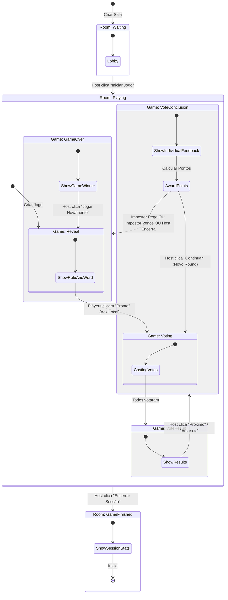

# Documentação Completa do Game Loop

Esta documentação consolida as informações sobre a `Game Engine` e a progressão visual das telas (UI), explicando como o estado flui desde o banco de dados até a interface do usuário.

---

## 1. Visão Geral da Engine

A **Game Engine** (`lib/game-engine`) é o cérebro da aplicação. Ela centraliza:

- **Estado**: Gerenciamento reativo de Room, Game, Round e Players.
- **Transições**: Validação e execução de mudanças de fase.
- **Ações**: Funções unificadas para interagir com o jogo.

O hook principal `useGameLoop` expõe tudo que a UI precisa para renderizar a tela correta.

### Diagrama de Estados (Fases do Jogo)

O jogo navega por dois tipos de estados principais:

1. **Room Status** (Status da Sala): Ciclo de vida da sessão (`waiting` -> `playing` -> `game_finished`).
2. **Game Status** (Status do Jogo): Ciclo de uma partida específica (`reveal` -> `voting` -> `vote_result` -> `vote_conclusion` -> `game_over`).

### Diagrama de Fluxo



---

## 2. Progressão das Telas (Screen Flow)

Abaixo detalhamos cada etapa do fluxo do usuário, conectando a **Fase Visual (`ViewPhase`)**, o **Componente** renderizado e a **Ação da Engine**.

### 1. Entrada na Sala

- **Fase**: `joining`
- **Componente**: `JoinRoomForm`
- **Descrição**: O usuário digita seu nome e o código da sala.
- **Ação**: Criação de jogador via Supabase (direto, fora da engine).
- **Próximo**: `lobby`

### 2. Lobby (Aguardando Início)

- **Fase**: `lobby`
- **Status da Sala**: `waiting`
- **Componente**: `Lobby.tsx`
- **O que acontece**:
  - Lista jogadores conectados.
  - Host vê o botão "Iniciar Jogo".
- **Ação do Host**: Clica em "Iniciar".
  - Chama: `startGame(word)` da engine.
  - **Lógica**: Cria registro `games`, define impostor, cria 1º `round`, muda room para `playing`.
- **Transição**: Todos os jogadores vão para `reveal`.

### 3. Revelação (Role Reveal)

- **Fase**: `reveal`
- **Status do Jogo**: `reveal`
- **Componente**: `GameScreen.tsx`
- **O que acontece**:
  - Jogadores veem se são "Inocentes" (e a palavra secreta) ou "Impostor".
  - Botão "Pronto" / "Entendido".
- **Ação do Jogador**: Clica em "Pronto".
  - Chama: `acknowledgeRole()` (Local + DB).
  - **Lógica**: O jogador muda localmente para a ViewPhase `waiting_for_start` e aguarda.
- **Transição Individual**: Jogador vê `WaitingForPlayersScreen.tsx`.
- **Gatilho de Transição**: Quando **todos** os jogadores confirmarem (host detecta).
  - Chama: `advanceToVoting()`.
  - **Lógica**: Muda status do jogo para `voting`.
- **Transição Geral**: Todos os jogadores vão para `voting` simultaneamente.

### 4. Votação (Voting)

- **Fase**: `voting`
- **Status do Jogo**: `voting`
- **Componente**: `VotingScreen.tsx`
- **O que acontece**:
  - Jogadores selecionam um suspeito OU uma ação (Pular/Encerrar).
  - Aguardam os outros votarem.
- **Ação do Jogador**: Seleciona e Confirma Voto.
  - Chama: `submitPlayerVote` ou `submitActionVote` (Supabase direto ou via helpers).
- **Gatilho de Transição**: Quando **todos** votam (monitorado pelo Host via `VotingScreen`).
  - Chamada automática do Host: `processVoteResult()`.
  - **Lógica**: Muda status do jogo para `vote_result`.
- **Transição**: Todos vão para `vote_result`.

### 5. Resultado da Votação (Group Result)

- **Fase**: `vote_result`
- **Status do Jogo**: `vote_result`
- **Componente**: `VoteResultScreen.tsx`
- **O que acontece**:
  - Mostra quem foi o mais votado (ou a ação vencedora) para **todos**.
  - Ninguém é eliminado efetivamente no banco ainda, é apenas visual.
- **Ação do Host**: Clica em "Continuar".
  - Chama: `proceedToConclusion(eliminatedId)`.
  - **Lógica**:
    - Se alguém foi eliminado, atualiza o DB (`rounds`).
    - Define a ação majoritária (`next_round`, `end_game`).
    - Muda status do jogo para `vote_conclusion`.
- **Transição**: Todos vão para `vote_conclusion`.

#### Critérios de Desempate

O sistema segue uma hierarquia estrita para resolver empates na contagem de votos:

1.  **Fim de Jogo (`end_game`)**: Tem a prioridade máxima. Se empatar com qualquer outra opção (jogadores ou pular), o jogo termina.
2.  **Próxima Rodada (`next_round` / Pular)**: Tem prioridade sobre eliminação de jogadores. Se empatar com o mais votado, a rodada é pulada.
3.  **Empate entre Jogadores**: Se dois ou mais jogadores empatarem em primeiro lugar, **ninguém é eliminado** (o jogo segue para a próxima rodada como se tivessem pulado).
4.  **Eliminação**: Só ocorre se um único jogador tiver a maioria absoluta dos votos (mais que qualquer outro jogador e mais que as ações).

### 6. Conclusão do Voto (Vote Conclusion)

- **Fase**: `vote_conclusion`
- **Status do Jogo**: `vote_conclusion`
- **Componente**: `VoteConclusionScreen.tsx`
- **O que acontece**:
  - Resultado da Votação: Mostra quem foi eliminado pelo grupo (ou se pularam).
  - Revela se o eliminado era o impostor ou não.
  - **Cálculo de Pontuação**: O componente calcula e atribui pontos (Impostor sobreviveu? Jogadores pegaram o impostor?).
- **Cenários**:
  1. **Impostor Pego**: Jogo acaba. Vitória dos Inocentes.
  2. **1v1 (Impostor + 1)**: Jogo acaba. Vitória do Impostor.
  3. **Votação para Encerrar**: Jogo acaba. Vitória do Impostor.
  4. **Ninguém Pego / Inocente Eliminado / Jogo Segue**: Vai para o próximo round.
- **Ação do Host**: Clica em "Continuar" (o texto varia: "Próximo Round" ou "Ver Resultados").
  - **Se o jogo continua**: Chama `startNextRound()`.
    - Cria novo round, muda status para `voting` (game loop reinicia no passo 4, mas sem reveal).
  - **Se o jogo acaba**: Chama `endGame(winner)`.
    - Muda status para `game_over`.

#### Sistema de Pontuação

Os pontos são atribuídos nesta tela quando o host avança:

| Evento                              | Pontos | Descrição                                        |
| :---------------------------------- | -----: | :----------------------------------------------- |
| **Voto Correto**                    |    +10 | Votar no impostor real                           |
| **Impostor Sobrevive à Rodada**     |     +5 | Impostor ganha pontos por cada rodada que escapa |
| **Jogadores Vencem (Capturam)**     |    +20 | Bônus para todos os inocentes                    |
| **Impostor Vence (1v1 ou Votação)** |    +20 | Bônus para o impostor                            |

_A lógica reside em `components/game/vote-conclusion-screen.tsx` na função `handleContinue()`._

### 7. Fim de Jogo (Game Over)

- **Fase**: `game_over`
- **Status do Jogo**: `game_over`
- **Componente**: `ResultsScreen.tsx`
- **O que acontece**:
  - Revela quem era o impostor e a palavra.
  - Mostra vencedor.
  - Host tem opções: "Jogar Novamente" ou "Encerrar Sessão".
- **Ação 1 (Jogar Novamente)**: `playAgain(newWord)`.
  - **Lógica**: Cria _novo_ registro `games`, novos `game_players`, novo `round`. Muda status para `reveal`.
  - **Transição**: Volta para o passo 3 (Revelação).
- **Ação 2 (Encerrar Sessão)**: `endSession()`.
  - **Lógica**: Muda status da **Sala** para `game_finished`.
  - **Transição**: Vai para `room_ended`.

### 8. Sessão Encerrada

- **Fase**: `room_ended`
- **Status da Sala**: `game_finished`
- **Componente**: `SessionEndedScreen.tsx`
- **O que acontece**:
  - Placar final acumulado de todas as partidas.
  - Ranking dos jogadores.
  - Botão para voltar à Home.

---

## 3. Mapeamento `useGameLoop` -> UI

O hook `useGameLoop` exporta a propriedade `viewPhase`, que é calculada combinando o status da Sala, o status do Jogo e o estado local do jogador (se já deu "ready").

No `app/room/[code]/page.tsx`, o mapeamento é direto:

```tsx
switch (viewPhase) {
  case "joining":
    <JoinRoomForm />;
  case "lobby":
    <Lobby />;
  case "reveal":
    <GameScreen />;
  case "voting":
    <VotingScreen />; // Apenas votação
  case "vote_result":
    <VoteResultScreen />; // Apenas resultado visual
  case "vote_conclusion":
    <VoteConclusionScreen />; // Pontuação e feedback
  case "game_over":
    <ResultsScreen />;
  case "room_ended":
    <SessionEndedScreen />;
}
```

## 4. Diferença Importante: Voting vs Vote Result

Uma mudança recente separou a tela de votação em duas etapas distintas para clareza:

1. **`VotingScreen`**:
   - Foco: Input do usuário.
   - Mostra: Opções de voto (jogadores, pular, encerrar).
   - Estado: `game.status === 'voting'`.

2. **`VoteResultScreen`**:
   - Foco: Feedback do grupo.
   - Mostra: "Fulano foi o mais votado" ou "A sala decidiu pular".
   - Estado: `game.status === 'vote_result'`.

Isso garante que todos vejam o resultado do consenso _antes_ da confirmação final (que acontece na tela seguinte, `VoteConclusion`, onde é revelado se o eliminado era o impostor).
