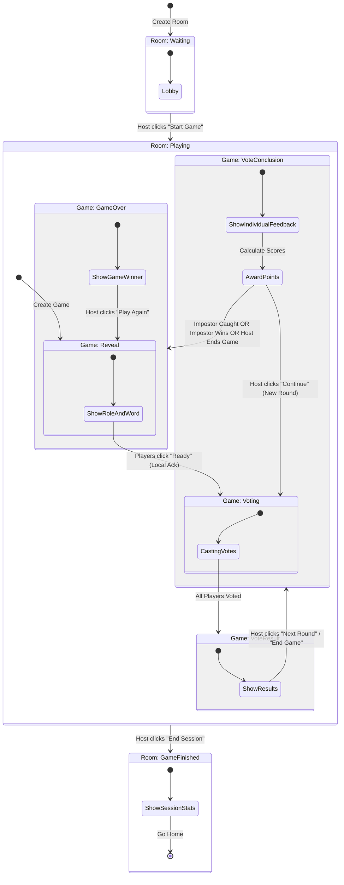

# Game Flow & Status Logic Documentation

This document explains the architecture of the game flow, focusing on how `Room` and `Game` statuses interact to control the user experience.

## Core Concept

The application separates the concept of a **Room** (the gathering place) from a **Game** (a single match).

- A **Room** persists across multiple games.
- A **Game** is created, played, and finished within a room.

## Data Models

### 1. Room Status (`rooms.status`)

Controls the high-level state of the lobby/session.

| Status          | Description                                             | UI Component                         |
| :-------------- | :------------------------------------------------------ | :----------------------------------- |
| `waiting`       | Initial state. Players join the lobby.                  | `<Lobby />`                          |
| `playing`       | A session is active. Games can be created and played.   | `<GameScreen />`, `<VotingScreen />` |
| `game_finished` | The host ended the session. Shows global stats/ranking. | `<SessionEndedScreen />`             |

### 2. Game Status (`games.status`)

Controls the specific phase of the current match. Only active when Room is `playing`.

**New Fields:**

- `winner`: 'impostor' | 'players' (set at game_over)
- `ended_at`: Timestamp (set at game_over)

| Status            | Description                                                                                                                                 | UI Component                           |
| :---------------- | :------------------------------------------------------------------------------------------------------------------------------------------ | :------------------------------------- |
| `reveal`          | **Start of Game**. Shows Role (Impostor/Citizen) and Secret Word. Players must acknowledge to proceed.                                      | `<GameScreen />`                       |
| `voting`          | **Discussion/Voting Phase**. Players discuss and vote on who is the impostor.                                                               | `<VotingScreen />`                     |
| `vote_conclusion` | **Vote Outcome**. Players see the result of the majority vote (who was eliminated and if they were the impostor). **Scoring happens here.** | `<VoteConclusionScreen />`             |
| `vote_result`     | **Round Results**. Shows who received votes and the outcome (Next Round / Elimination).                                                     | `<VotingScreen />` (Result Mode)       |
| `game_over`       | **End of Game**. A winner is determined (Impostor or Players).                                                                              | `<ResultsScreen />` (Game Result Mode) |

---

## Scoring System

Points are awarded in the `<VoteConclusionScreen />` when the host clicks "Continue".

| Event                               | Points | Description                                       |
| :---------------------------------- | -----: | :------------------------------------------------ |
| **Correct Vote**                    |    +10 | Voting for the actual impostor                    |
| **Impostor Survives Round**         |     +5 | Impostor earns points for each round they survive |
| **Players Win (Catch Impostor)**    |    +20 | Bonus to all non-impostor players                 |
| **Impostor Wins (1v1 or Vote End)** |    +20 | Bonus to the impostor                             |

### Scoring Logic Location

- File: `components/game/vote-conclusion-screen.tsx`
- Function: `handleContinue()`

---

## Game Flow Diagram



## Detailed Transitions

### 1. Starting a Game

- **Trigger**: Host clicks "Start" in `<Lobby />`.
- **Action**:
  1.  Create a new entry in `games` table.
  2.  Set `games.status` = `'reveal'`.
  3.  Set `rooms.status` = `'playing'`.
- **Result**: All players are redirected to the Role/Word reveal screen.

### 2. Transition to Voting

- **Trigger**: All players click "Ready" in `<GameScreen />` (Host detects).
- **Action**:
  - **Local**: Player sees "Waiting for players...".
  - **Server**: Updates `game_players.role_acknowledged` to `true`.
  - **Global**: When all are ready, Host calls `advanceToVoting()`. Updates `games.status` to `'voting'`.
- **Result**: All players transition to `<VotingScreen />` simultaneously.

### 3. Voting Results

- **Trigger**: All players have submitted their votes.
- **Action**: Update `games.status` to `'vote_result'`.
- **Result**: The `<VotingScreen />` updates to show the results of the round.

### 4. Vote Conclusion & Next Round

- **From Vote Results**:
  - **Trigger**: Host clicks "Next Round" (or "End Game").
  - **Action**: Update `games.status` to `'vote_conclusion'`.
  - **Result**: Top-voted player is eliminated (if applicable) or action recorded. Users see if their vote was correct.

- **From Vote Conclusion**:
  - **Trigger**: Host clicks "Continue".
  - **Action**:
    1. **Award Points** based on voting accuracy and game state.
    2. **Next Round**: Creates a new round and sets `games.status` back to `'voting'`.
    3. **Game Over**: If the Impostor is caught, or the Impostor wins (1v1), or the Host manually ends the game, update `games.status` to `'game_over'`.

### 5. Play Again

- **Trigger**: Host clicks "Play Again" in `<ResultsScreen />`.
- **Action**: Creates a _new_ game entry (resetting round to 1) and sets its status to `'reveal'`.

### 6. End Session

- **Trigger**: Host clicks "End Session" in `<ResultsScreen />`.
- **Action**: Update `rooms.status` to `'game_finished'`.
- **Result**: All players see the `<SessionEndedScreen />` with:
  - **Final Score Ranking** - Players sorted by total points
  - **Special Rankings**:
    - 🎯 Best Detective (most correct votes on impostor)
    - 🎭 Master of Disguise (most rounds survived as impostor)
    - 🤔 Most Indecisive (most "skip round" votes)
    - 💀 Most Suspicious (most times eliminated)
    - 👀 Most Accused (most votes received)
  - **Detailed Statistics Table** - Per-player breakdown of all stats

---

## Game Loop Engine

A centralized engine for managing game state, transitions, and actions.

### File Structure

| File                               | Purpose                                          |
| :--------------------------------- | :----------------------------------------------- |
| `lib/game-engine/types.ts`         | Type definitions for phases, states, and actions |
| `lib/game-engine/state-machine.ts` | Valid transitions and validation functions       |
| `lib/game-engine/transitions.ts`   | Centralized transition functions                 |
| `lib/game-engine/hooks.ts`         | `useGameLoop` React hook                         |
| `lib/game-engine/index.ts`         | Main exports                                     |

### Usage

```tsx
import { useGameLoop } from "@/lib/game-engine";

function GamePage({ roomCode }: { roomCode: string }) {
  const {
    // State
    viewPhase,
    room,
    game,
    currentRound,
    players,
    gamePlayers,

    // Computed
    currentPlayer,
    currentGamePlayer,
    isHost,
    isImpostor,

    // Loading
    isLoading,
    isTransitioning,

    // Actions
    startGame,
    advanceToVoting,
    processVoteResult,
    proceedToConclusion,
    startNextRound,
    endGame,
    playAgain,
    endSession,
    acknowledgeRole,
    refresh,
  } = useGameLoop(roomCode);

  // Render based on viewPhase
  switch (viewPhase) {
    case "lobby":
      return <Lobby onStart={() => startGame("apple")} />;
    case "reveal":
      return <GameScreen onReady={acknowledgeRole} />;
    case "voting":
      return <VotingScreen />;
    // ...
  }
}
```

### Valid Transitions

#### Room Transitions

```
waiting → playing (startGame)
playing → game_finished (endSession)
```

#### Game Transitions

```
reveal → voting (advanceToVoting / acknowledgeRole)
voting → vote_result (processVoteResult)
vote_result → vote_conclusion (proceedToConclusion)
vote_conclusion → voting (startNextRound)
vote_conclusion → game_over (endGame)
game_over → reveal (playAgain)
```

### ViewPhase Mapping

| ViewPhase         | Condition                     |
| :---------------- | :---------------------------- |
| `joining`         | No room or no current player  |
| `lobby`           | Room waiting, no game         |
| `reveal`          | Game status = reveal          |
| `voting`          | Game status = voting          |
| `vote_result`     | Game status = vote_result     |
| `vote_conclusion` | Game status = vote_conclusion |
| `game_over`       | Game status = game_over       |
| `room_ended`      | Room status = game_finished   |
