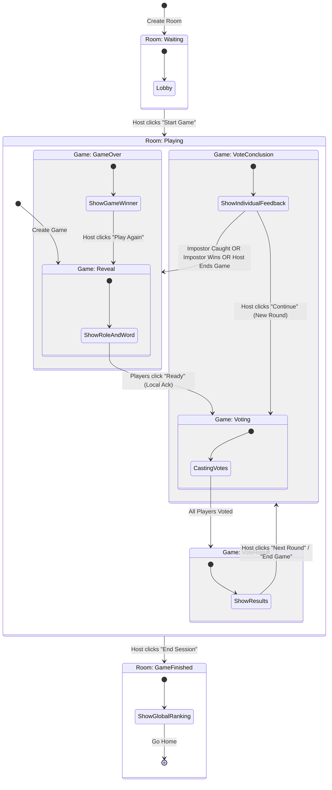

# Game Flow & Status Logic Documentation

This document explains the architecture of the game flow, focusing on how `Room` and `Game` statuses interact to control the user experience.

## Core Concept

The application separates the concept of a **Room** (the gathering place) from a **Game** (a single match).

- A **Room** persists across multiple games.
- A **Game** is created, played, and finished within a room.

## Data Models

### 1. Room Status (`rooms.status`)

Controls the high-level state of the lobby/session.

| Status          | Description                                           | UI Component                         |
| :-------------- | :---------------------------------------------------- | :----------------------------------- |
| `waiting`       | Initial state. Players join the lobby.                | `<Lobby />`                          |
| `playing`       | A session is active. Games can be created and played. | `<GameScreen />`, `<VotingScreen />` |
| `game_finished` | The host ended the session. Shows global ranking.     | `<ResultsScreen />` (Ranking Mode)   |

### 2. Game Status (`games.status`)

Controls the specific phase of the current match. Only active when Room is `playing`.

| Status            | Description                                                                                                                                                                                                                                    | UI Component                           |
| :---------------- | :--------------------------------------------------------------------------------------------------------------------------------------------------------------------------------------------------------------------------------------------- | :------------------------------------- |
| `reveal`          | **Start of Game**. Shows Role (Impostor/Citizen) and Secret Word. **Note:** Players can individually advance to the `voting` screen by clicking "Ready", even if the global status is still `reveal`. This status acts as a soft sync barrier. | `<GameScreen />`                       |
| `voting`          | **Discussion/Voting Phase**. Players discuss and vote on who is the impostor.                                                                                                                                                                  | `<VotingScreen />`                     |
| `vote_conclusion` | **Individual Vote Result**. Players see if their individual vote was correct (Impostor or not).                                                                                                                                                | `<VoteConclusionScreen />`             |
| `vote_result`     | **Round Results**. Shows who received votes and the outcome (Next Round / Elimination).                                                                                                                                                        | `<VotingScreen />` (Result Mode)       |
| `game_over`       | **End of Game**. A winner is determined (Impostor or Players).                                                                                                                                                                                 | `<ResultsScreen />` (Game Result Mode) |

---

## Game Flow Diagram

## detailed Transitions

### 1. Starting a Game

- **Trigger**: Host clicks "Start" in `<Lobby />`.
- **Action**:
  1.  Create a new entry in `games` table.
  2.  Set `games.status` = `'reveal'`.
  3.  Set `rooms.status` = `'playing'`.
- **Result**: All players are redirected to the Role/Word reveal screen.

### 2. Transition to Voting

- **Trigger**: Individual Player clicks "Ready to Vote" in `<GameScreen />`.
- **Action**:
  - **Local**: The app records that the player has acknowledged the round (saved in `localStorage`). The UI transitions to `<VotingScreen />` for that player _immediately_.
  - **Global**: The game status remains `'reveal'` until/unless updated (though the app now relies on local readiness to show the voting screen).
- **Result**: Players can start voting independently. The global state naturally progresses when everyone casts their vote (triggering `vote_result`) OR if the Host manually forces a start (legacy behavior, button removed for now).

### 3. Voting Results

- **Trigger**: All players have submitted their votes.
- **Action**: Update `games.status` to `'vote_result'`.
- **Result**: The `<VotingScreen />` updates to show the results of the round.

### 4. Vote Conclusion & Next Round

- **From Vote Results**:
  - **Trigger**: Host clicks "Next Round" (or "End Game").
  - **Action**: Update `games.status` to `'vote_conclusion'`.
  - **Result**: Top-voted player is eliminated (if applicable) or action recorded. Users see if their vote was correct.

- **From Vote Conclusion**:
  - **Trigger**: Host clicks "Continue".
  - **Action**:
    - **Next Round**: Creates a new round and sets `games.status` back to `'voting'`.
    - **Game Over**: If the Impostor is caught, or the Impostor wins (1v1), or the Host manually ends the game, update `games.status` to `'game_over'`.

### 5. Play Again

- **Trigger**: Host clicks "Play Again" in `<ResultsScreen />`.
- **Action**: Creates a _new_ game entry (resetting round to 1) and sets its status to `'reveal'`.

### 6. End Session

- **Trigger**: Host clicks "End Session" in `<ResultsScreen />`.
- **Action**: Update `rooms.status` to `'game_finished'`.
- **Result**: All players see the final leaderboard showing scores accumulated across all games in the session.
